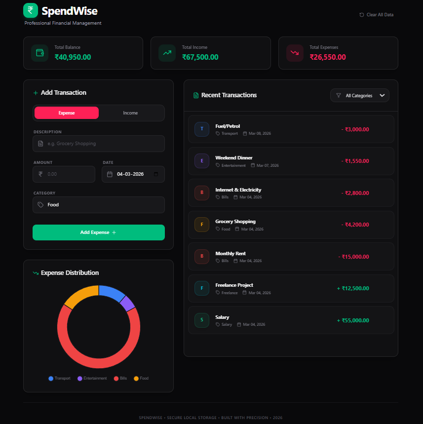

# 💰 SpendWise - Professional Expense Tracker


**SpendWise** is a sleek, mobile-first financial tool designed to track daily expenses, visualize spending patterns, and manage budgets through a modern dark-themed dashboard.

---

### 🚀 Key Features
* **Real-time Analytics:** Visualizes data using **Chart.js** doughnut charts.
* **Local Persistence:** Uses **LocalStorage** to ensure your financial records stay saved even after refreshing the page.
* **INR Localization:** Fully formatted for Indian currency (**₹**) including proper comma numbering.
* **Secure Deletion:** Includes a custom **Confirmation Modal** to prevent accidental "Clear All Data" actions.
* **Responsive UI:** Optimized for both Desktop and Mobile views with a focus on touch-friendly interactions.

---

### 🛠️ Technical Implementation
* **State Management:** Built with **React Functional Components** and Hooks.
* **Type Safety:** Developed using **TypeScript** for robust, error-free code.
* **Layout Fixes:** Implemented custom CSS positioning to solve icon overlap issues in input fields.
* **Animations:** Integrated CSS Keyframes for smooth transaction list transitions and dashboard updates.

---

### 📸 Preview


---

### 📥 Installation
1. Clone the repo:
   ```bash
   git clone [https://github.com/Afsal-Palliyal/spendwise-expense-tracker.git](https://github.com/Afsal-Palliyal/spendwise-expense-tracker.git)